#  Salut, moi c'est Amine ! 👋 

### 🚀 Lead Fullstack Engineer & Tech Strategist
**Expert TypeScript (React, Node.js, React Native)** spécialisé dans la conception d'architectures scalables et l'intégration de solutions IA (RAG).

---

## 👨‍💻 À propos de moi
- 🛠️ **Ce que je fais :** Je pilote des projets de bout en bout, de la réponse aux appels d'offres jusqu'au déploiement sécurisé sur AWS.
- 💡 **Ma spécialité :** Créer des architectures "from scratch" robustes et migrer des écosystèmes complexes vers des stacks unifiées.
- 🎓 **Formation :** Diplômé d'un Master 2 Logiciels Sûrs (UPEC) et ingénieur de formation.
- 📍 **Localisation :** Créteil / Paris, France.

---

## 🛠 Compétences Techniques
| Secteur | Technologies |
| :--- | :--- |
| **Frontend & Mobile** |    |
| **Backend** |    |
| **Cloud & DevOps** |    |
| **Base de données** |   |

---

## 📊 Statistiques & Activité

---

## 🏆 Réalisations Marquantes
* **Projet APHP :** Conception et mise en production d'une application mobile React Native pour le suivi de pathologies chroniques.
* **Innovation IA :** Développement d'une plateforme utilisant le RAG pour interroger des bases de connaissances via des agents LLM.
* **Stratégie :** Gain de 2 projets majeurs en 2026 (APHP & Assurance Maladie) via pilotage autonome d'appels d'offres.

---

## 📫 Me contacter
- 🌐 **Portfolio :** [amine-ouldkaci.fr](https://amine-ouldkaci.fr) 
- 💼 **LinkedIn :** [in/amine-ould-kaci](https://www.linkedin.com/in/amine-ould-kaci)
- ✉️ **Email :** [a.ouldkaci02@gmail.com](mailto:a.ouldkaci02@gmail.com)

---
*Dernière mise à jour : Avril 2026*
